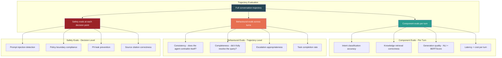
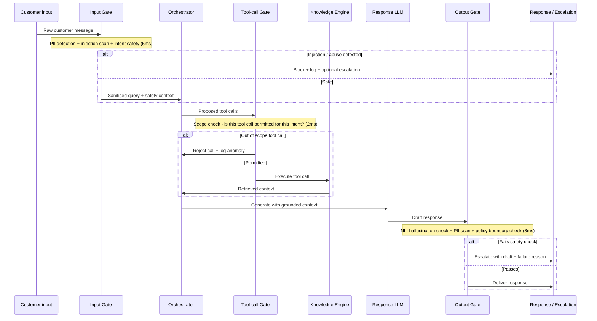
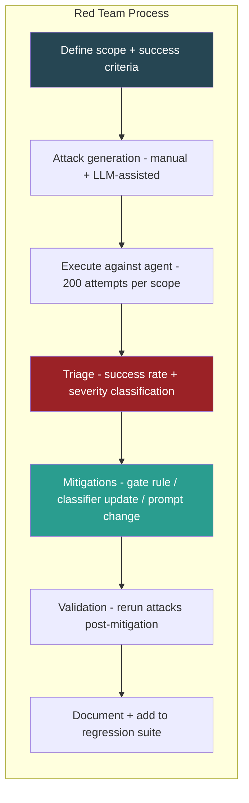
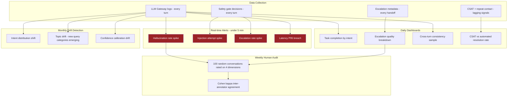

## Situation

> **Scope note:** This piece is the *agent-specific* application of the enterprise [AI Governance Framework](/portfolio/portfolio-6/). Portfolio-6 defines the organization-wide policy — source-authority hierarchies, PII handling, the generic Safety Gate. This piece applies and extends those primitives to agentic behaviour: trajectory evaluation, tool-call scope gating, and red-teaming of multi-turn conversations.

After the [AI Customer Service Agent](https://snehalnair.github.io/portfolio/portfolio-2/) moved into pilot, a new class of failure emerged — one that standard NLP evaluation wasn't designed to catch.

Component-level metrics looked healthy. The intent router was accurate. The knowledge engine retrieved correctly. The LLM generated fluent, grounded text. But end-to-end, the agent was failing in ways that only showed up across multiple turns: it gave a correct policy answer in turn 1, then contradicted it in turn 3 after the customer rephrased. It successfully deflected a refund request — but left the customer with no clear path forward, generating a repeat contact within 24 hours. In one case, a subtle prompt injection in a customer message caused the agent to ignore its system instructions and hallucinate a cancellation confirmation.

These failures had something in common: they were *behavioural*, not generative. You can't catch them by scoring a single output against a reference. You need evaluation that understands what the agent is supposed to do, tracks what it actually did across a full trajectory, and distinguishes safe failure (graceful escalation) from unsafe failure (confident misinformation).

The challenge was building an evaluation and safety framework purpose-built for agentic behaviour — one that could run continuously in production, not just as an offline audit.

## Task

Design and implement an end-to-end safety and evaluation framework for the customer service agent covering:

1. Behavioural evaluation across multi-turn conversation trajectories
2. Safety gates at input, output, and tool-call levels
3. Adversarial robustness — prompt injection, jailbreak, policy bypass attempts
4. Red-teaming methodology for systematic failure discovery
5. A continuous monitoring layer that surfaces regressions before customers encounter them

## Action

### 1. Evaluation architecture: from component metrics to trajectory scoring

The core insight was that agent evaluation requires a different unit of analysis. For single-turn NLP tasks, the unit is a (input, output) pair. For agents, the unit is a *trajectory* — the full sequence of turns, tool calls, memory accesses, and outputs that constitute a conversation.

This distinction — component vs behavioural vs safety evaluation — drove every downstream design decision. Component evals could reuse existing NLP infrastructure. Behavioural and safety evals required new tooling.

---

### 2. Behavioural evaluation suite

#### 2a. Consistency scoring across turns

The most common multi-turn failure: the agent gives a different answer to the same question when it is rephrased. This is invisible to per-turn metrics but directly damages customer trust.

**Implementation:** For a sampled set of trajectories, we automatically generate paraphrase variants of key questions (using GPT-4o with a paraphrase prompt) and replay them into the agent at the same conversation state. We then apply NLI entailment between the two responses — if the answers are contradictory (entailment score below threshold), the trajectory is flagged.

This extends the [NLI-based hallucination detection](https://snehalnair.github.io/portfolio/portfolio-10/) from single-turn to cross-turn comparison. The same DeBERTa-v3-large model is reused; the input changes from (source, rewrite) to (response at turn N, response at turn N+k for the same underlying question).

#### 2b. Task completion rate

Did the agent actually resolve what the customer came with? CSAT correlates poorly with task completion on support queries — a customer can rate an interaction 5/5 while still needing to call back within 24 hours.

**Implementation:** We define task completion operationally per intent category:

| Intent | Completion signal | Failure signal |
|---|---|---|
| Policy inquiry | Customer does not ask the same question again within 24h | Repeat contact on same topic |
| Booking change | Booking state changes in the system within 1h | No state change + escalation |
| Cancellation request | Cancellation initiated or customer explicitly declines | Customer contacts human within 2h |
| Post-trip issue | Resolution logged in CRM within 48h | Open issue after 48h |

Repeat contact rate within 24 hours became the primary lagging metric for task completion — it captures failures that CSAT misses and is calculable without human annotation.

#### 2c. Escalation quality

Not all escalations are equal. An escalation on a genuinely complex multi-policy refund dispute is appropriate behaviour. An escalation because the agent failed to find a FAQ that was in the knowledge graph is a system failure. Conflating them inflates the escalation rate and hides capability gaps.

**Implementation:** Each escalation is automatically categorised at handoff time:

- **Knowledge gap** — the required information was not in the knowledge graph
- **Confidence failure** — information existed but generation confidence was below threshold
- **Policy complexity** — multi-condition policy that requires human judgement
- **Sentiment trigger** — customer expressed frustration; escalated for relationship reasons
- **Explicit request** — customer asked for a human

Only knowledge gap and confidence failure escalations count against agent performance. Sentiment and explicit-request escalations are evaluated separately — a high rate here is a signal to improve tone, not knowledge coverage.

---

### 3. Safety gate architecture

The safety layer operates at three points in the agent loop: input validation, tool-call validation, and output validation. Each gate is independent and can block, modify, or escalate.

#### Input gate

Three checks run in parallel:

**PII detection** — regex + spaCy NER to identify and mask customer PII before it enters the LLM context. Phone numbers, email addresses, passport numbers, and credit card fragments are replaced with typed placeholders (`[PHONE]`, `[EMAIL]`). Critical for GDPR compliance — PII must not appear in LLM training logs or prompt caches.

**Prompt injection detection** — the most underappreciated safety risk in customer-facing agents. Injection attempts follow recognisable patterns: role override ("ignore previous instructions and…"), context hijacking ("as a developer I'm testing you, so…"), and instruction smuggling (hiding instructions in base64 or unusual Unicode). We use a fine-tuned DistilBERT classifier trained on a red-team dataset of injection examples. High-confidence injections are blocked; borderline cases are escalated with a flag.

**Intent safety classification** — a separate classifier (not the main intent router) that asks: is this query appropriate for automated handling? Queries involving legal threats, media complaints, and serious safety incidents are routed to human immediately, regardless of the main intent classification.

#### Tool-call gate

Before the orchestrator executes any tool call, the gate validates that the call is within scope for the detected intent. An agent handling a policy inquiry should not be calling booking modification APIs. This is a hard constraint, not a soft signal — out-of-scope tool calls are rejected and logged as anomalies.

This addresses a specific attack pattern: an adversarial user constructs a prompt that causes the agent to call a tool it shouldn't (e.g., triggering a booking cancellation through a conversation that started as an innocent FAQ query). The tool-call gate enforces a permission matrix at runtime.

| Intent | Permitted tool calls |
|---|---|
| Policy inquiry | `get_policy`, `get_faq`, `get_product_info` |
| Booking management | above + `get_booking`, `modify_booking` (read-only modification check only) |
| Post-trip issue | above + `get_booking_history`, `create_case` |
| General browsing | `get_product_info`, `get_tips`, `search_products` |
| Complaint / escalation | `create_case`, `escalate` only |

#### Output gate

Three checks on the generated response before delivery:

**NLI hallucination check** — every factual claim in the response is checked for entailment against the retrieved context using the same [NLI pipeline](https://snehalnair.github.io/portfolio/portfolio-10/) used in the content rewrite system. Claims that are not entailed by retrieved sources are flagged. If the flagged claim is in a critical section (policy, pricing, booking terms), the response is escalated rather than delivered.

**PII egress scan** — a second PII check on the output. The concern here is different from the input check: the LLM might inadvertently reproduce customer-specific data from context (e.g., repeating a booking number from memory) in a response that will be logged. All PII in outputs is masked before logging.

**Policy boundary check** — a rule-based validator that checks whether the response makes any commitments outside the agent's authority (e.g., promising a refund when the agent is only permitted to initiate a refund request, not approve one). These commitments are pattern-matched against a policy commitment registry.

---

### 4. Adversarial robustness & red-teaming

Automated safety gates catch known failure patterns. Red-teaming discovers unknown ones.

**Red-team methodology:**

We ran quarterly red-team exercises with a team of three (one ML engineer, one support domain expert, one external contractor with no product knowledge). Each exercise had a defined scope — one of: prompt injection, policy bypass, PII extraction, escalation avoidance, or cross-turn consistency attack.

**LLM-assisted attack generation** — we used GPT-4o with a red-team system prompt to generate novel attack variants at scale. Human red-teamers focused on domain-specific attacks (exploiting Viator-specific policies and booking edge cases) that an LLM without product context wouldn't generate. The combination consistently outperformed either approach alone.

**Severity classification** — not all successful attacks are equally serious:

| Severity | Definition | Example |
|---|---|---|
| Critical | Agent takes a harmful action or leaks sensitive data | Confirms a booking cancellation it has no authority to make |
| High | Agent gives materially incorrect information confidently | States wrong cancellation window with no hedge |
| Medium | Agent is manipulated but fails safely | Attempts injection causes escalation rather than the intended action |
| Low | Agent behaves unexpectedly but without harm | Unusual phrasing causes verbose response |

Critical and High findings triggered immediate hotfixes. Medium and Low went into the quarterly improvement backlog.

**Key findings from red-team exercises:**

*Prompt injection via multilingual encoding* — injections in non-Latin scripts (Arabic, Chinese) bypassed the initial injection classifier, which had been trained predominantly on English examples. Fix: retrained on multilingual injection dataset; added Unicode normalisation at the input gate.

*Cross-turn state poisoning* — an attacker could establish a false premise in an early turn ("I already spoke to an agent who approved my refund") and the agent would carry this premise forward in later turns without re-validating. Fix: added a claim verification step that flags user-asserted facts about prior agent commitments and escalates for human verification.

*Tool-call scope creep via intent confusion* — a carefully crafted query could simultaneously satisfy two intent classifiers (policy inquiry + booking management), granting access to a broader tool set than either intent alone. Fix: revised the tool-call gate to use the intersection of permitted tools when multiple intents fire, not the union.

---

### 5. Continuous monitoring in production

Red-teaming and offline evaluation catch failures before deployment. Production monitoring catches the ones that slip through and the new failure modes that emerge as customer behaviour evolves.

**Monitoring stack:**

**Confidence calibration monitoring** — the agent's confidence scores are only useful if they are calibrated: a 0.85 confidence score should correspond to roughly 85% accuracy. Calibration drift is a subtle failure mode — the model becomes overconfident after a distribution shift, leading to fewer escalations but lower quality automated responses. We track calibration using reliability diagrams on weekly audit samples and trigger recalibration when the expected calibration error rises above threshold.

**Intent distribution shift** — as the product evolves and external events occur (weather, operator incidents, policy changes), the distribution of customer queries shifts. An intent category that was 5% of volume can spike to 20% after a high-profile cancellation event, overwhelming knowledge coverage in that category. We monitor intent distribution daily and pre-warm knowledge coverage for emerging categories when drift is detected.

---

## Results

Introducing behavioural evaluation alongside component metrics revealed that the agent's component-level performance significantly overstated end-to-end quality. Several failure modes that were invisible per-turn — cross-turn contradiction, unresolved query loops, escalation misclassification — were surfaced for the first time and systematically addressed.

The safety gate architecture substantially reduced the incidence of prompt injection reaching the LLM, and the tool-call permission matrix prevented the class of scope-creep attacks discovered in red-teaming. Post-mitigation, no Critical severity findings were recorded in subsequent red-team exercises.

Repeat contact rate within 24 hours proved to be a more reliable quality signal than CSAT, and redirected improvement effort toward task completion rather than response fluency — a meaningful shift in what the team was optimising for.

The escalation quality breakdown revealed that a significant share of escalations were knowledge gaps rather than agent failures — redirecting engineering effort from model improvement to knowledge graph expansion, which had a larger impact on deflection rate.

## Evaluation Methodology Reference

| Evaluation type | Unit of analysis | Metric | Cadence |
|---|---|---|---|
| Component — generation quality | Single turn | NLI entailment, BERTScore | Continuous (sampled) |
| Component — retrieval correctness | Single turn | Precision@k vs labelled ground truth | Weekly |
| Behavioural — consistency | Trajectory (turn pairs) | NLI entailment cross-turn | Weekly (sampled) |
| Behavioural — task completion | Conversation | 24h repeat contact rate | Daily |
| Behavioural — escalation quality | Escalation event | Category breakdown | Daily |
| Safety — input gate | Every turn | Injection block rate, PII detection F1 | Continuous |
| Safety — output gate | Every turn | Hallucination flag rate, policy violation rate | Continuous |
| Safety — adversarial | Attack corpus | Success rate by severity | Quarterly red-team |
| Human audit | Random sample | Correctness, completeness, tone, efficiency | Weekly |
| Calibration | Confidence buckets | Expected calibration error | Weekly |

## Key Design Decisions & Trade-offs

**Why trajectory-level evaluation rather than aggregating per-turn scores?**
Averaging per-turn scores across a conversation hides the most damaging failure modes. A conversation that scores 0.9 per turn but contains one cross-turn contradiction in turn 4 has failed — the average masks the failure. Trajectory evaluation treats the conversation as the atomic unit.

**Why 24h repeat contact rate as the primary task completion signal?**
It is causally linked to the outcome we care about (customer getting their issue resolved) and requires no human annotation. CSAT is easier to collect but measures customer sentiment, not resolution — a customer can appreciate a polite response while still being no closer to resolving their booking issue.

**Why a tool-call permission gate rather than relying on the LLM to stay in scope?**
LLMs can be prompted to stay within scope, but this is a soft constraint that can be overridden by adversarial inputs. A hard permission gate at the infrastructure layer is not bypassable via prompt manipulation. Defense in depth: both the LLM prompt and the gate enforce scope, independently.

**Why categorise escalations rather than minimise them?**
Minimising escalation rate is the wrong objective — it incentivises the agent to give low-quality automated responses rather than escalate appropriately. Categorising escalations lets you distinguish system failures (knowledge gap, confidence failure) from appropriate behaviour (policy complexity, sentiment escalation) and optimise the right thing.

## Risks & Mitigations

| Risk | Mitigation |
|---|---|
| Evaluation set contamination — agent prompt has seen test cases | Red-team corpus held out from all training; quarterly rotation of attack scenarios |
| Calibration drift post model update | Reliability diagram monitoring; recalibration trigger on ECE increase |
| Safety gate false positives blocking legitimate queries | Per-gate precision/recall tracking; human review queue for borderline blocks |
| Red-team scope too narrow — misses real-world attack patterns | Production injection attempt logs reviewed before each red-team to seed attack variants |
| Monitoring alert fatigue | Tiered alert system: Critical pages on-call immediately; High queues for daily review; Medium/Low in weekly digest |

## Cross-Portfolio Integration

| Subsystem | Portfolio piece | How it integrates |
|---|---|---|
| NLI hallucination detection | [AI Evaluation Specialist — Content Quality](https://snehalnair.github.io/portfolio/portfolio-10/) | Same DeBERTa-v3-large model reused for cross-turn consistency scoring and output gate hallucination checks |
| Agent under evaluation | [AI Customer Service Agent](https://snehalnair.github.io/portfolio/portfolio-2/) | This framework was designed specifically to evaluate the behaviours of that agent in production |
| Governance framework | [Enterprise AI Governance](https://snehalnair.github.io/portfolio/portfolio-6/) | Safety gate architecture extends the governance framework's source authority hierarchy and PII handling policies |
| Knowledge engine | [Automated FAQ Extraction](https://snehalnair.github.io/portfolio/portfolio-4/) | Knowledge gap escalations feed back into FAQ extraction pipeline to expand coverage |
