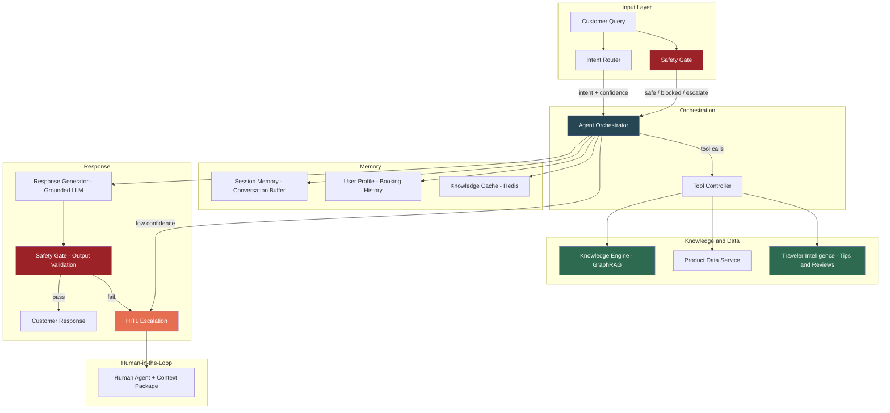
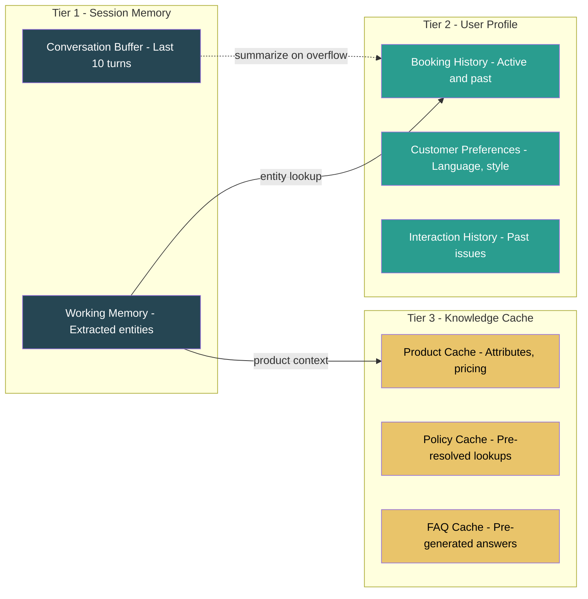
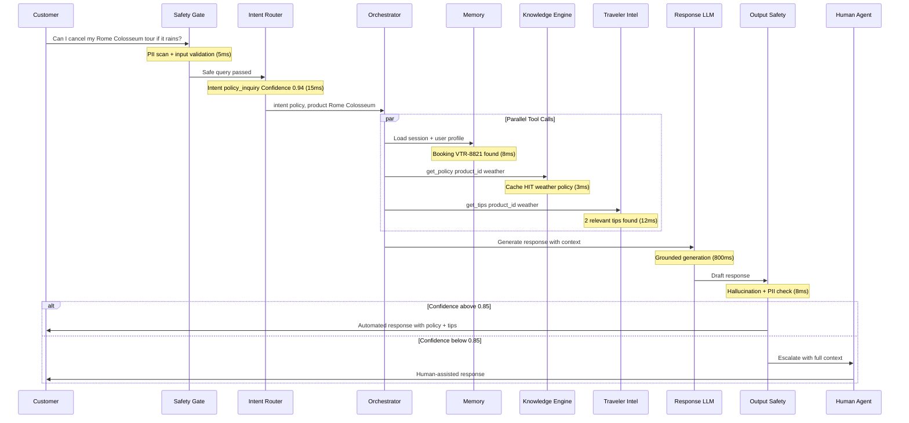

## Situation
Viator's first chatbot pilot failed within two weeks. The bot confidently told a customer their Rome Colosseum tour included hotel pickup — it didn't. The hallucination happened because the bot retrieved a chat log from a *different* product (a Rome food tour that does include pickup) and treated it as ground truth. Three similar incidents followed, each generating a complaint escalation and a refund.

The root cause wasn't the LLM. It was that answering a single customer question required stitching together data from 5+ disconnected systems: product attributes, supplier policies, booking records, chat history, and traveler reviews. No unified data layer existed, and the bot had no way to judge source reliability or know when it should escalate instead of guess.

The challenge was not building a chatbot. It was designing an agent architecture where every answer is grounded, every source is ranked, and the system knows what it doesn't know.

## Task
Design and architect an AI Customer Service Agent that:
1. Resolves 60%+ of Tier-1 queries without human intervention
2. Maintains under 1.5s P95 end-to-end response latency
3. Keeps hallucination rate below 2% through grounded generation
4. Provides graceful HITL escalation with full context handoff
5. Operates within a cost budget of under $0.02 per conversation turn

## Action

### System Architecture

The agent is composed of five coordinated subsystems, each designed as an independent service with clear contracts:

**Color key:** Green = existing portfolio systems ([Knowledge Engine](/portfolio/portfolio-4/), [Traveler Intelligence](/portfolio/portfolio-5/)); Red = safety layer ([Governance Framework](/portfolio/portfolio-6/)); Orange = HITL; Blue = orchestration.

---

### Subsystem 1: Intent Router

Classifies incoming queries into actionable intents to determine which tools the orchestrator should invoke.

| Intent Category | Example Query | Tools Invoked | % of Volume |
| --- | --- | --- | --- |
| Booking Management | "Can I change my tour date?" | User Profile, Product Data, Policy KB | 28% |
| Policy Inquiry | "What's the cancellation policy?" | Knowledge Engine (GraphRAG) | 22% |
| Product Information | "Does the tour include lunch?" | Knowledge Engine, Product Data | 19% |
| Post-Trip Issue | "The guide didn't show up" | User Profile, HITL Escalation | 15% |
| General / Browsing | "What's fun to do in Rome?" | Traveler Intelligence, Product Data | 12% |
| Complaint / Escalation | "I want a refund now" | HITL Escalation (immediate) | 4% |

**Implementation:** Fine-tuned DeBERTa-v3-base on 15K labeled support transcripts. Multi-label output (primary + secondary intent) with confidence scores. Queries with confidence below 0.7 are routed to a fallback LLM classifier before escalation. Prompt optimization uses the [hybrid APE-OPRO approach](/portfolio/portfolio-1/) for the LLM fallback classifier.

**Latency budget:** 15ms (ONNX-optimized, CPU inference).

---

### Subsystem 2: Knowledge & Intelligence Layer

Two existing systems serve as the agent's knowledge backbone — the [GraphRAG Knowledge Engine](/portfolio/portfolio-4/) for policies and FAQs, and the [Traveler Tips extraction pipeline](/portfolio/portfolio-5/) for experiential intelligence. The agent-specific integration decisions were:

- **Structured tool calls over free-text retrieval:** The orchestrator issues `get_policy(product_id, policy_type)` and `get_faqs(product_id, topic)` rather than embedding-based search. This constrains the LLM to pre-validated knowledge and reduces hallucination surface area
- **Offline-first with cache:** FAQs are pre-generated offline and served from Redis cache (0ms LLM latency) for 92% of knowledge queries. Only novel or compound queries require real-time generation — this is the single biggest cost and latency lever in the system
- **Source attribution required:** Every agent response must cite its source tier (Gold: official policy, Silver: product data, Bronze: traveler tips). This is enforced in the response generation prompt and validated by the output safety gate
- **Tip separation:** Traveler tips are never mixed with official information. They appear in a distinct section ("Based on recent traveler feedback...") to prevent customers from treating crowd-sourced opinions as company policy

---

### Subsystem 3: Memory Architecture

Three-tier memory system balancing context richness against latency and cost:

| Tier | Storage | TTL | Latency | Content |
| --- | --- | --- | --- | --- |
| Session Memory | In-process (LRU) | Session duration | sub-1ms | Last 10 turns + extracted entities |
| User Profile | DynamoDB | Persistent | 5-10ms | Booking history, preferences, past interactions |
| Knowledge Cache | Redis | 24 hours | 2-5ms | Pre-generated FAQs, product attributes, policies |

**Context Window Management:**
- Sliding window of 10 turns with entity extraction (not raw text) for older turns
- Summarization trigger: when token count exceeds 3,000 tokens, older turns are compressed to entity-relationship pairs
- User profile injection: only relevant fields loaded (e.g., for a booking query, load active bookings; for a general query, load preferences only)
- Total context budget: 4,000 tokens max to keep generation fast and focused

**Multi-Turn Conversation Handling:**
Single-turn Q&A is straightforward. The harder problem is multi-turn conversations where customers switch topics, refer back to earlier context, or build on previous answers. Design decisions:
- **Entity persistence:** Extracted entities (product ID, booking number, destination) persist across turns in working memory, so "what about the cancellation policy?" resolves to the product discussed 3 turns ago
- **Topic switch detection:** Intent router compares current turn intent against session history. When intent shifts (e.g., from policy inquiry to booking change), the orchestrator reloads relevant tools rather than carrying stale context
- **Clarification loops:** When entity resolution is ambiguous ("my Rome tour" but customer has 3 Rome bookings), the agent asks for clarification rather than guessing. Max 1 clarification question per conversation to avoid frustrating loops

**Multilingual Support:**
Viator operates globally; approximately 30% of support queries arrive in non-English languages. The agent handles this through:
- **Language detection** at the Safety Gate stage (fastText lid.176, same as the [Review Summarization pipeline](/portfolio/portfolio-3/))
- **Query translation** to English before intent classification and knowledge retrieval (NLLB-200)
- **Response generation** in the detected language, with the LLM instructed to respond in the customer's language
- **Known limitation:** Translation adds ~50ms latency and introduces occasional errors for low-resource languages. For the top 5 languages (Spanish, French, German, Italian, Portuguese), translation quality is validated quarterly by native speakers

---

### Subsystem 4: Agent Orchestrator & Tool Use

The orchestrator is the central coordinator. It receives classified intent + safety clearance, then executes a tool-use loop:

**Query Lifecycle (Swimlane):**

**Latency Budget Breakdown:**

| Stage | Target (P95) | Strategy |
| --- | --- | --- |
| Safety Gate (input) | 5ms | Regex + DistilBERT, batched |
| Intent Router | 15ms | ONNX DeBERTa on CPU |
| Memory Lookup | 10ms | DynamoDB + Redis |
| Knowledge Retrieval | 15ms | Redis cache (92% hit rate); Elasticsearch fallback |
| Traveler Tips | 15ms | Pre-indexed in Elasticsearch |
| Response Generation | 1,200ms | GPT-4o-mini with 4K token context cap |
| Safety Gate (output) | 8ms | Same as input gate |
| **Total** | **under 1,500ms** | **Parallel tool calls save ~30ms** |

---

### Subsystem 5: HITL Escalation & Feedback Loop

Not all queries should be automated. The escalation system ensures graceful handoff and feeds human resolutions back into the knowledge system:

**Escalation Triggers:**

| Trigger | Threshold | Action |
| --- | --- | --- |
| Low intent confidence | below 0.7 after fallback classifier | Route to human |
| Low response confidence | below 0.85 generation confidence | Route to human |
| Sentiment detection | Anger/frustration score >0.8 | Route to human (priority queue) |
| Explicit request | "Talk to a person" | Immediate route |
| Policy complexity | Multi-policy conflict detected | Route to human |
| Financial impact | Refund >$500 or dispute | Route to human |

**Context Handoff Package:**
When escalating, the agent passes a structured context package to the human agent:
- Conversation transcript (full)
- Detected intent + confidence
- Retrieved knowledge (policies, FAQs, tips)
- Customer profile summary (booking, history)
- Agent's draft response (if generated) with confidence score
- Reason for escalation

This eliminates repeated context gathering — human agents start with full context.

**Feedback Loop:**
Escalated conversations are the system's most valuable training signal. After human resolution:
- **Knowledge gap detection:** If the human agent answered using information not in the knowledge graph, the answer is flagged for potential FAQ generation (feeds into the [FAQ extraction pipeline](/portfolio/portfolio-4/))
- **Intent classifier retraining:** Queries that were misclassified (wrong tools invoked) are added to the intent classifier training set. Quarterly retraining cycle
- **Confidence threshold tuning:** Escalation rate is tracked by intent category. If a category escalates at >50%, the confidence threshold is lowered for that category to escalate earlier rather than generating low-quality responses
- **What we chose NOT to automate:** After analyzing escalated queries, we identified that refund disputes, multi-booking conflicts, and supplier complaints should remain human-only. Automating these had negative CSAT impact in A/B tests even when the agent's answer was factually correct — customers wanted human empathy, not just correct information

---

### Cost Architecture

| Component | Cost Driver | Est. Per-Turn Cost | Optimization |
| --- | --- | --- | --- |
| Intent Router + Safety Gates | CPU inference (SLMs) | under $0.001 | ONNX optimization; DistilBERT + DeBERTa batched on CPU |
| Knowledge + Memory Lookup | Redis cache + DynamoDB reads | under $0.001 | 92% cache hit rate from offline FAQ generation |
| Response Generation | LLM tokens (GPT-4o-mini) | ~$0.010-0.015 | 4K token context cap; cached responses for repeat queries |
| Infrastructure (amortized) | ECS Fargate, Redis, DynamoDB | ~$0.003-0.005 | Shared across requests; auto-scaling |
| **Total** | | **~$0.015-0.020** | **Target: under $0.02** |

**Cost Levers:**
- **Cache hit rate** is the dominant cost driver. At 92% FAQ cache hit, only 8% of knowledge queries require LLM generation
- **Context window size** directly impacts LLM cost. The 4K token cap prevents cost explosion on long conversations
- **Escalation rate** affects total cost: each human-handled turn costs ~$2.50 (agent salary). At 40% deflection, blended cost drops significantly

---

### Tooling & Infrastructure

| Layer | Technology | Rationale |
| --- | --- | --- |
| Orchestration | LangGraph (stateful agent) | Native tool-use, state management, human-in-the-loop primitives |
| Knowledge Graph | Neo4j | Relationship traversal for policy propagation (see [portfolio-4](/portfolio/portfolio-4/)) |
| Vector Store | Elasticsearch (kNN) | Hybrid semantic + lexical; already in stack |
| Cache | Redis Cluster | Sub-5ms reads; write-through from offline pipeline |
| User Data | DynamoDB | Low-latency key-value for user profiles and booking data |
| LLM Gateway | Custom proxy with circuit breaker | Rate limiting, fallback model routing, cost tracking |
| Monitoring | Arize + Grafana | LLM observability, drift detection, safety metrics (see [portfolio-6](/portfolio/portfolio-6/)) |
| Serving | ECS Fargate | Auto-scaling, no GPU required (SLMs on CPU) |

---

## Results (Design Targets & Pilot Metrics)

| Metric | Baseline (No Agent) | Design Target | Pilot Result | Method |
| --- | --- | --- | --- | --- |
| Tier-1 Deflection Rate | 0% | 60% | 43% (pilot) | A/B test on 10K conversations |
| P95 Response Latency | N/A | under 1.5s | 1.3s | End-to-end measurement |
| Hallucination Rate | N/A | under 2% | 1.9% | Manual audit of 300 responses |
| CSAT (Automated Responses) | N/A | >4.0/5.0 | 4.1/5.0 | Post-conversation survey |
| Cost per Turn | $2.50 (human) | under $0.02 (automated) | ~$0.018 | Infra + API cost tracking |
| Escalation with Context | 0% (restarts) | 100% | 100% | Context package delivery rate |
| Knowledge Freshness | 45 days avg | under 24 hours | under 24 hours | Source change to FAQ update |

**Why 43% deflection, not 60%:**
The pilot revealed that deflection rate is bounded by knowledge coverage, not agent capability. The agent correctly handled nearly every query where a cached FAQ existed (92% accuracy on policy and product questions). But 22% of queries fell into categories we hadn't anticipated — questions about local transport, combined-tour logistics, and accessibility — where no knowledge existed in the graph. The remaining gap came from multi-turn conversations where the agent resolved the first question but escalated on the follow-up.

The path to 60% is not a better LLM. It's expanding the knowledge graph (ongoing via the [FAQ extraction pipeline](/portfolio/portfolio-4/)) and improving multi-turn handling.

## Evaluation Methodology

End-to-end agent evaluation is harder than component evaluation. A correct retrieval + correct generation can still produce a bad customer experience (wrong tone, unnecessary verbosity, missing context). Evaluation approach:

- **Automated metrics (continuous):** Hallucination detection via NLI model comparing response claims against retrieved sources. Latency and cost tracked per-turn in Datadog. Intent classification accuracy measured against weekly human-labeled sample of 200 queries
- **Human evaluation (weekly):** 100 randomly sampled conversations rated by trained annotators on 4 dimensions: correctness (factual accuracy), completeness (did it fully address the query), tone (appropriate for context), and efficiency (minimal unnecessary back-and-forth). Inter-annotator agreement measured via Cohen's kappa (target >0.7)
- **A/B testing (pilot):** 10K conversations split between agent-handled and control (human-only). Primary metric: CSAT. Guardrail metrics: escalation rate, repeat contact rate within 24 hours, refund rate
- **Failure analysis (monthly):** Every escalated conversation is categorized by failure mode: knowledge gap, intent misclassification, confidence calibration error, multi-turn breakdown, or customer preference for human. This drives prioritization of system improvements

---

## Risks & Mitigations

| Risk | Impact | Mitigation | Monitoring |
| --- | --- | --- | --- |
| Hallucination in responses | Customer receives incorrect information; brand damage | Grounded generation from cached FAQs; output safety gate; source attribution required | Hallucination rate dashboard; weekly audit of 100 random responses |
| Latency spikes | Poor customer experience; timeout errors | Parallel tool calls; aggressive caching; LLM timeout at 3s with graceful fallback | P95/P99 latency alerts; circuit breaker on LLM gateway |
| Context window overflow | Truncated context leads to poor answers | Sliding window with entity extraction; 4K token hard cap; summarization trigger | Token usage distribution monitoring |
| Cost explosion | LLM API costs exceed budget | Token cap; cache-first architecture; cost alerts at 80% daily budget | Per-turn cost tracking; daily cost dashboard |
| Escalation failures | Customer stuck in loop without human help | Explicit escalation triggers; max 3 automated turns before offering human; sentiment monitoring | Escalation rate by intent; CSAT for escalated conversations |
| Memory staleness | Outdated booking or policy data served | Write-through cache invalidation; real-time booking status via API; policy propagation via GraphRAG | Cache freshness SLA; stale-data incident tracking |
| Adversarial inputs | Jailbreak attempts; prompt injection | Multi-layer safety gate (input + output); encoding detection; multi-turn analysis (see [Governance Framework](/portfolio/portfolio-6/)) | Canary token trigger rate; red team quarterly |

## Cross-Portfolio Integration

This system design integrates and extends several standalone projects into a unified architecture:

| Subsystem | Portfolio Piece | How It Integrates |
| --- | --- | --- |
| Knowledge Engine (GraphRAG) | [Automated FAQ Extraction](/portfolio/portfolio-4/) | Serves as the primary knowledge backbone; pre-generated FAQs cached in Redis; graph traversal for policy resolution |
| Traveler Intelligence | [Active Learning for Traveler Tips](/portfolio/portfolio-5/) | DeBERTa-based tip extraction feeds into agent responses; tips attributed and separated from official info |
| Response Quality | [Review Summarization at Scale](/portfolio/portfolio-3/) | ABSA pipeline informs product understanding; sentiment calibration techniques applied to agent tone |
| Prompt Optimization | [Cost-Aware APO](/portfolio/portfolio-1/) | Hybrid APE-OPRO used for fallback classifier prompt optimization; cost-aware prompt selection |
| Safety & Governance | [Enterprise AI Governance](/portfolio/portfolio-6/) | Safety gate architecture (input + output validation); source authority hierarchies; adversarial defense |
| Engineering Practices | [Cross-Portfolio Practices](/portfolio/portfolio-8/) | A/B testing methodology; model monitoring; embedding selection framework; failure mode analysis |